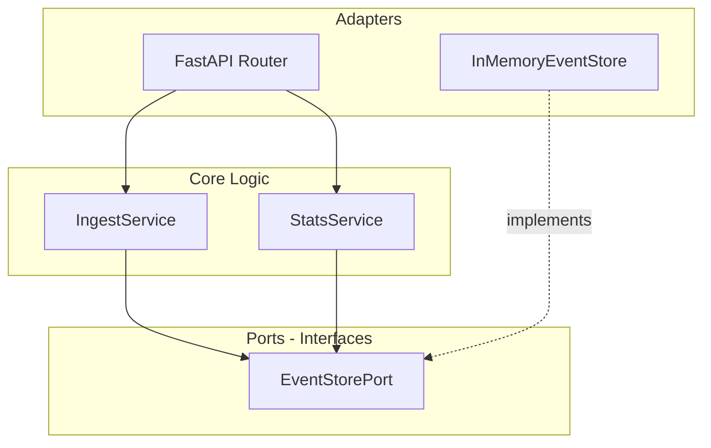

# Realtime Events Analytics API - Development Plan

## Tech Stack (aligned with [AGENTS.md](experiments/apps/event_ingestor/AGENTS.md))


| Layer              | Choice                              |
| ------------------ | ----------------------------------- |
| Runtime            | Python 3.14                         |
| Web Framework      | FastAPI                             |
| Storage (MVP)      | SQLite (async)                      |
| Validation         | Pydantic v2 (built-in with FastAPI) |
| Linting/Formatting | Ruff (existing)                     |
| Testing            | pytest, pytest-asyncio (existing)   |


**Dependency to add**: `fastapi`, `uvicorn[standard]` in [pyproject.toml](experiments/apps/event_ingestor/pyproject.toml)

---

## API Endpoints

### Core (Required)


| Method | Path      | Purpose                                                 |
| ------ | --------- | ------------------------------------------------------- |
| POST   | `/ingest` | Accept single event or batch of events                  |
| GET    | `/stats`  | Return aggregated statistics (counts, time range, etc.) |


### Suggested Additions


| Method | Path      | Purpose                                                                                                        |
| ------ | --------- | -------------------------------------------------------------------------------------------------------------- |
| GET    | `/health` | Liveness/readiness probe (standard for k8s, load balancers)                                                    |
| GET    | `/events` | List recent events with optional filters (pagination, type, time window) — useful for debugging and dashboards |


---

## Light Hexagonal Architecture

Keep adapters minimal; avoid heavy `domain/`, `infrastructure/` layering.




**Structure under `src/`**:

```
src/
  main.py              # FastAPI app wiring
  api/
    routes.py          # Route definitions (ingest, stats, health, events)
    schemas.py         # Pydantic request/response models
  interfaces/
    event_store.py     # ABC for event storage
  services/
    ingest.py          # Ingest logic (validate, persist)
    stats.py           # Stats aggregation logic
  adapters/
    async_sqlite_store.py    # SQLite Async EventStore implementation
```

- **Port**: `EventStorePort` (ABC) with `append(events)`, `get_stats()`, `list_events()`.
- **Adapters**: `AsyncSqliteEventStore` for MVP; later add `RedisEventStore`, `PostgresEventStore` without changing services.

---

## Event Model (MVP)

Generic event shape for flexibility:

```python
# Minimal schema
{"id": UUID, "source": str, "event_type": str, "timestamp": str (ISO8601), "payload": dict}
```

Keep payload open for extensibility.

---

## Stats Response (MVP)

- `total_events`: int
- `events_by_type`: dict[str, int]
- `time_range`: optional `{earliest, latest}` timestamps
- `ingested_at`: optional for "realtime" freshness

---

## Implementation Order

1. **Add FastAPI + uvicorn** to `pyproject.toml`.
2. **Define Interface**`EventStore` in `src/interfaces/event_store.py`.
3. **Implement** `AsyncSqliteEventStore` in `src/adapters/async_sqlite_store.py`.
4. **Create schemas** (`Event`, `IngestRequest`, `StatsResponse`) in `src/api/schemas.py`.
5. **Implement services** `IngestService`, `StatsService` in `src/services/`.
6. **Wire routes** in `src/api/routes.py` (ingest, stats, health, optional events).
7. **Bootstrap app** in `src/main.py` with dependency injection of the store.
8. **Add tests** in `tests/` for services and API (pytest + TestClient).

---

## Out of Scope (Later)

- Authentication/authorization
- Rate limiting
- Metrics (Prometheus)
- Async ingestion (queues)

